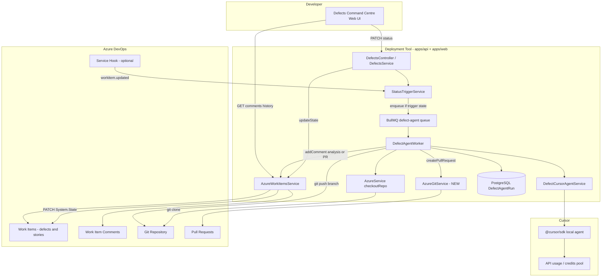
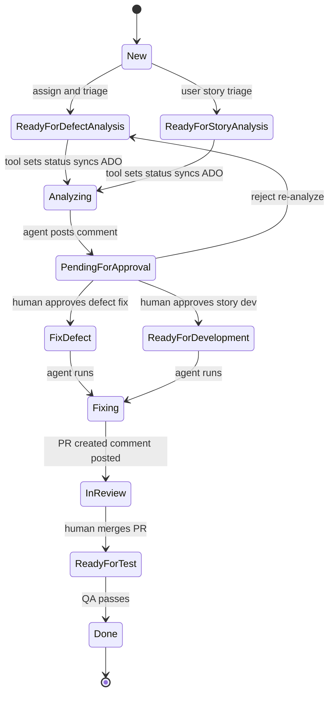
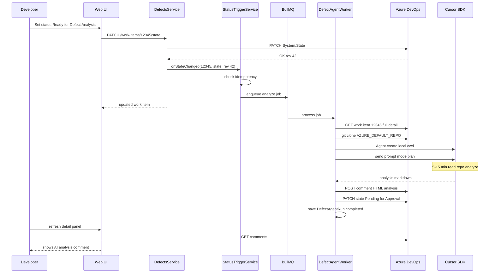
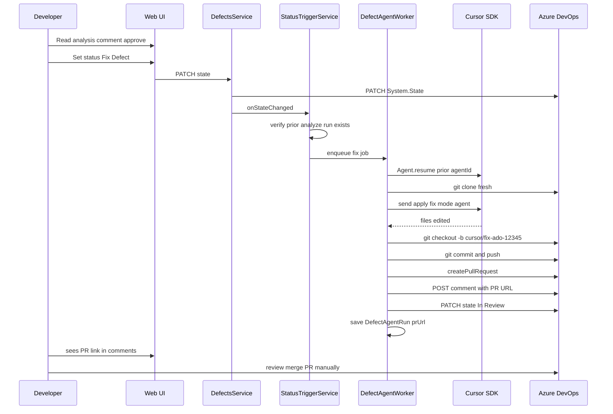
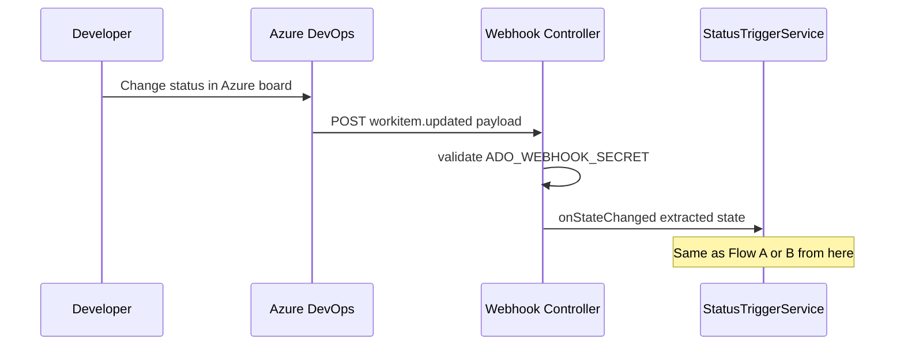

# Master build plan — AI defect & user story automation

**Goal:** When a developer changes a work item status in the Defects Command Centre, Azure DevOps syncs, a Cursor agent analyzes or fixes code in your Azure git repo, and results appear as comments (and PRs) on the work item.

**Technology choice:** `@cursor/sdk` **local runtime** (not hosted Cloud Agents API) because your source code is in **Azure DevOps Git**, not GitHub. Your **10,000 Cursor credits** pay for model tokens on every agent run.

---

## 1. Complete system architecture



### Data flow summary

| Direction | What moves | How |
|-----------|------------|-----|
| Tool → ADO | Status changes | Already works — `PATCH System.State` |
| Tool → ADO | Analysis / PR comments | **New** — `addComment()` |
| ADO → Tool | Work items, comments, history | Already works — REST read APIs |
| Tool → Git | Clone, branch, push | Existing `checkoutRepo` + **new** push + PR |
| Tool → Cursor | Agent prompts | **New** — `@cursor/sdk` local |
| Cursor → Tool | Analysis text, file edits | Agent run result + git diff |

---

## 2. Prerequisites checklist

Complete **all** of these before building Phase A.

### 2.1 Cursor (you provide)

| # | Prerequisite | Details | How to verify |
|---|--------------|---------|---------------|
| C1 | **Cursor paid plan** with API access | Pro/Teams with Cloud Agents / API enabled | Dashboard loads, API keys page visible |
| C2 | **`CURSOR_API_KEY`** | Team service account key recommended | `curl -u "$CURSOR_API_KEY:" https://api.cursor.com/v1/models` |
| C3 | **Credits / spend limit** | ~10,000 credits; enable on-demand if needed; set hard limit | Cursor dashboard → Usage |
| C4 | **Model choice** | Default `composer-2.5` with `fast: true` for analysis | Smoke test returns result |
| C5 | **Node.js 22.13+** on API/worker host | Required by `@cursor/sdk` | `node --version` |
| C6 | **git** on API/worker host | Already used for deployments | `git --version` |
| C7 | **Disk space** | ~2–5 GB free per concurrent clone (temp, cleaned after job) | Monitor worker temp dir |

### 2.2 Azure DevOps (you configure)

| # | Prerequisite | Details | How to verify |
|---|--------------|---------|---------------|
| A1 | **Azure org connected** in tool | Environment Center → Integrations | Defects board loads work items |
| A2 | **PAT with expanded scopes** | Work Items Read & Write; Code Read & Write; Pull Request Read & Write | Test state update + clone + push |
| A3 | **Process template states** | Custom states must exist in ADO before tool can set them | See section 3.2 |
| A4 | **Default repo env vars** | `AZURE_DEFAULT_PROJECT`, `AZURE_DEFAULT_REPO`, `AZURE_DEFAULT_BRANCH` | Already in [apps/api/.env.example](apps/api/.env.example) |
| A5 | **Service account PAT** (recommended) | Dedicated ADO user for automation, not personal PAT | Repo-scoped permissions |
| A6 | **Branch policies** (awareness) | PR may need reviewers; agent won't auto-merge | Configure in ADO repo settings |
| A7 | **Public API URL** (for webhook) | HTTPS endpoint reachable by ADO | Only needed for Phase F |

### 2.3 Infrastructure (already in project)

| # | Prerequisite | Details |
|---|--------------|---------|
| I1 | **PostgreSQL** | New `DefectAgentRun` table |
| I2 | **Redis** | BullMQ `defect-agent` queue |
| I3 | **API + worker process** | Worker runs agent jobs (same pattern as `metadata-deploy.worker.ts`) |

### 2.4 Information we need from you before build

| Item | Example | Why |
|------|---------|-----|
| Exact ADO state names | `Ready for Defect Analysis` | Must match process template exactly |
| Work item types in scope | Bug, Defect, User Story | Different prompts per type |
| Target branch for PRs | `master` or `develop` | PR target ref |
| Who can trigger agents | Assignee only vs admin too | RBAC rules |
| Auto-status after analysis? | Yes → `Pending for Approval` | Config |
| Keep "Investigate with AI" button? | Hide or keep as re-run | UI scope |

---

## 3. Azure DevOps setup guide (step by step)

### 3.1 PAT creation / upgrade

1. Azure DevOps → User settings → **Personal access tokens** (or service account)
2. Create token with scopes:
   - **Work Items** — Read & write
   - **Code** — Read & write
   - **Pull Request Threads** — Read & write (or full Code scope)
3. Paste PAT in tool → **Environment Center → Integrations → Azure DevOps**
4. Store same PAT in server env if not only in encrypted integration store: `AZURE_DEVOPS_PAT`

### 3.2 Add custom states to your process

In Azure DevOps → Project settings → **Teams** → **Boards** → **Customization**:

Add states to **Bug** and **User Story** (or your types) workflows:

| State name (example) | Category | Purpose |
|----------------------|----------|---------|
| Ready for Defect Analysis | Proposed / Active | Triggers defect analysis agent |
| Ready for User Story Analysis | Proposed / Active | Triggers story analysis agent |
| Pending for Approval | Active | Human reviews AI comment |
| Fix Defect | Active | Triggers fix agent + PR |
| Ready for Development | Active | Triggers story implementation agent + PR |
| In Review | Active | After PR created — human reviews code |
| Ready for Test | Active | QA validation |

**Critical:** State names in ADO must **exactly match** env config (case-sensitive).

### 3.3 Repo and branch

1. Confirm Salesforce DX repo is in ADO: `AZURE_DEFAULT_REPO`
2. Confirm working branch: `AZURE_DEFAULT_BRANCH` (e.g. `master`)
3. Ensure PAT can clone and push to that repo
4. Optional: create branch policy requiring PR for `master` (agent creates PR, human merges)

### 3.4 Service hook (Phase F — optional for v1)

1. Project settings → **Service hooks** → Create subscription
2. Event: **Work item updated**
3. Action: **Web Hooks**
4. URL: `https://your-api-host/defects/webhooks/work-item-updated`
5. Resource details: filter by work item type if needed
6. Set `ADO_WEBHOOK_SECRET` in API env; validate on every request

### 3.5 Azure env vars (add to apps/api/.env)

```env
# Existing
AZURE_DEVOPS_ORG="your-org"
AZURE_DEVOPS_PAT="your-pat"
AZURE_DEFAULT_PROJECT="Your Project"
AZURE_DEFAULT_REPO="Your Salesforce Repo"
AZURE_DEFAULT_BRANCH="master"

# New — status trigger map (match your ADO process exactly)
DEFECT_STATUS_ANALYZE_DEFECT="Ready for Defect Analysis"
DEFECT_STATUS_ANALYZE_STORY="Ready for User Story Analysis"
DEFECT_STATUS_FIX_DEFECT="Fix Defect"
DEFECT_STATUS_DEVELOP_STORY="Ready for Development"
DEFECT_STATUS_AFTER_ANALYSIS="Pending for Approval"
DEFECT_STATUS_AFTER_FIX="In Review"

# New — Cursor
CURSOR_API_KEY="cursor_..."
CURSOR_AGENT_MODEL="composer-2.5"

# New — webhook (Phase F)
ADO_WEBHOOK_SECRET="long-random-secret"

# New — limits
DEFECT_AGENT_MAX_RUNS_PER_USER_PER_DAY=20
DEFECT_AGENT_JOB_TIMEOUT_MS=1800000
```

---

## 4. Cursor setup guide (step by step)

### 4.1 API key

1. [cursor.com/dashboard](https://cursor.com/dashboard) → Integrations / API Keys
2. Create **service account** key (preferred for server automation)
3. Add `CURSOR_API_KEY` to `apps/api/.env` and worker environment
4. Set spend limit in dashboard; note your ~10,000 credit pool

### 4.2 Install SDK

```bash
cd apps/api
npm install @cursor/sdk
```

Requires Node **22.13+**.

### 4.3 Smoke test (before integration)

Create a one-off script on the API server:

1. Clone Azure repo with existing `checkoutRepo`
2. Run:

```typescript
import { Agent } from "@cursor/sdk";

await using agent = await Agent.create({
  apiKey: process.env.CURSOR_API_KEY!,
  model: { id: "composer-2.5", params: [{ id: "fast", value: "true" }] },
  local: { cwd: workspaceDir, settingSources: [] },
});
const run = await agent.send("List top-level folders in this Salesforce project.", { mode: "plan" });
const result = await run.wait();
console.log(result.status, result);
```

4. Confirm credits decrement in Cursor dashboard
5. Confirm `agent.agentId` starts with `agent-` (local)

---

## 5. What to add to the Deployment Tool

### 5.1 Database (Prisma) — NEW

**Model: `DefectAgentRun`**

| Field | Type | Purpose |
|-------|------|---------|
| id | uuid | Primary key |
| workItemId | int | ADO work item # |
| project | string | ADO project name |
| workItemType | string | Bug, User Story, etc. |
| workItemRev | int | ADO revision at trigger time |
| triggerState | string | Status that started this run |
| phase | enum | `analyze` \| `fix` |
| status | enum | `queued` \| `running` \| `completed` \| `failed` \| `cancelled` |
| cursorAgentId | string | `agent-...` for resume |
| cursorRunId | string | Latest run id |
| repo | string | Azure repo name |
| branch | string | Base branch |
| fixBranch | string? | `cursor/fix-ado-12345` |
| prUrl | string? | ADO PR link after fix |
| resultMarkdown | text? | Analysis output |
| error | text? | Failure message |
| triggeredByUserId | string | Firebase user id |
| bullJobId | string? | Queue job id |
| createdAt / updatedAt | datetime | Timestamps |

File: [packages/db/prisma/schema.prisma](packages/db/prisma/schema.prisma)

### 5.2 Backend API — NEW endpoints

| Method | Path | Purpose |
|--------|------|---------|
| GET | `/defects/work-items/:id/agent-runs` | List agent runs for work item |
| GET | `/defects/agent-runs/:runId` | Poll job status + result |
| POST | `/defects/agent-runs/:runId/cancel` | Cancel running job |
| POST | `/defects/webhooks/work-item-updated` | ADO service hook (Phase F) |

**Modified endpoints:**

| Method | Path | Change |
|--------|------|--------|
| PATCH | `/defects/work-items/:id/state` | After ADO update → call `StatusTriggerService` |
| POST | `/defects/work-items/:id/investigate` | Enqueue async job instead of sync NVIDIA (or remove if status-only) |

### 5.3 Backend services — NEW files

| File | Responsibility |
|------|----------------|
| `apps/api/src/modules/defects/status-trigger.service.ts` | Map state → action; idempotency; enqueue |
| `apps/api/src/modules/defects/defect-cursor-agent.service.ts` | Wrap `@cursor/sdk` create/send/resume |
| `apps/api/src/integrations/azure/azure-git.service.ts` | `createPullRequest`, `pushBranch` |
| `apps/api/src/workers/defect-agent.worker.ts` | BullMQ consumer: clone → agent → comment/PR |
| `apps/api/src/modules/defects/defect-agent-queue.service.ts` | Enqueue, job metadata |

**Modified files:**

| File | Change |
|------|--------|
| [apps/api/src/integrations/azure/azure-work-items.service.ts](apps/api/src/integrations/azure/azure-work-items.service.ts) | Add `addComment(id, html, project)` |
| [apps/api/src/modules/defects/defects.service.ts](apps/api/src/modules/defects/defects.service.ts) | Hook `updateState`; replace `investigate` |
| [apps/api/src/modules/defects/defects.module.ts](apps/api/src/modules/defects/defects.module.ts) | Register new services |
| [apps/api/src/modules/workers/workers.module.ts](apps/api/src/modules/workers/workers.module.ts) | Register defect-agent worker |
| [apps/api/.env.example](apps/api/.env.example) | New env vars |

### 5.4 Frontend (Defects Command Centre) — NEW UI

| Component / change | Purpose |
|--------------------|---------|
| **Agent run badge** on detail panel | "Analyzing…" / "Fixing…" / "Failed" |
| **Agent run history** section | List past runs with timestamps |
| **PR link card** | Show ADO PR URL when fix completes |
| **Poll job status** in `use-defects-workspace.ts` | Refresh every 5s while running |
| **Status dropdown** | No change — already syncs to ADO |
| **Comments thread** | No change — reads ADO comments (analysis appears here) |
| Optional: hide **Investigate with AI** button | If status-only workflow |

Files:

- [apps/web/src/modules/defects-command-centre/defect-detail-panel.tsx](apps/web/src/modules/defects-command-centre/defect-detail-panel.tsx)
- [apps/web/src/modules/defects-command-centre/use-defects-workspace.ts](apps/web/src/modules/defects-command-centre/use-defects-workspace.ts)
- NEW: `defect-agent-run-panel.tsx`

### 5.5 Shared types — NEW

Add to [packages/shared/src/azure-work-items.ts](packages/shared/src/azure-work-items.ts):

- `DefectAgentRunSummary`
- `DefectAgentRunDetail`
- `DefectAgentPhase`, `DefectAgentRunStatus` enums

### 5.6 Documentation — NEW

- `docs/defect-ai-agent-setup.md` — Azure + Cursor setup for operators
- Update [docs/developer-board-email-alerts.md](docs/developer-board-email-alerts.md) — cross-link webhook

---

## 6. Complete status state machine



### Status → system action matrix

| Status (configurable) | Agent? | Mode | On success |
|-----------------------|--------|------|------------|
| Ready for Defect Analysis | Yes | plan | Comment + → Pending for Approval |
| Ready for User Story Analysis | Yes | plan | Comment + → Pending for Approval |
| Pending for Approval | No | — | Human only |
| Fix Defect | Yes | agent + PR | PR comment + → In Review |
| Ready for Development | Yes | agent + PR | PR comment + → In Review |
| In Review / Ready for Test / Done | No | — | Human only |

---

## 7. Detailed flows

### Flow A — Defect analysis (status trigger)



### Flow B — Fix defect (after approval)



### Flow C — User story development

Same as Flow B except:

- Trigger state: `Ready for Development`
- Prompt focuses on acceptance criteria implementation
- Branch: `cursor/story-ado-{id}`
- PR title: `feat: ADO-{id} — {title}`

### Flow D — Status changed in Azure UI (Phase F)



---

## 8. Build phases (execution order)

### Phase 0 — Prerequisites (you + dev, 1–2 days)

- [ ] Cursor API key + spend limit
- [ ] Azure PAT upgraded scopes
- [ ] ADO custom states created
- [ ] Env vars configured
- [ ] SDK smoke test passes
- [ ] Confirm exact state names documented

### Phase A — Foundation (2–3 days)

- [ ] `DefectAgentRun` Prisma model + migration
- [ ] `defect-agent` BullMQ queue + worker skeleton
- [ ] `GET /defects/agent-runs/:runId` polling API
- [ ] Env config loader for status trigger map

### Phase B — Status triggers + ADO comments (2–3 days)

- [ ] `StatusTriggerService`
- [ ] Hook `updateState()` in defects.service
- [ ] `azureWorkItems.addComment()`
- [ ] Auto-transition status after analysis
- [ ] Idempotency checks

### Phase C — Cursor agent worker (3–5 days)

- [ ] `DefectCursorAgentService` with `@cursor/sdk`
- [ ] Analysis prompt builder (defect vs story)
- [ ] Worker: clone → analyze → comment
- [ ] Store `cursorAgentId` for resume
- [ ] Deprecate NVIDIA `DefectInvestigationAgent` path

### Phase D — UI (2–3 days)

- [ ] Agent run badge + polling in detail panel
- [ ] Show analysis from comments (existing thread)
- [ ] Error states + retry guidance
- [ ] Optional: hide manual Investigate button

### Phase E — Fix + PR (3–4 days)

- [ ] `AzureGitService` — push branch + create PR
- [ ] Fix/develop status triggers
- [ ] `Agent.resume()` fix flow
- [ ] PR URL comment + In Review auto-status
- [ ] Git credentials via PAT on push URL

### Phase F — ADO webhook (1–2 days)

- [ ] Webhook controller + secret validation
- [ ] Parse `System.State` from payload
- [ ] Operator setup doc for service hook

### Phase G — Hardening (2–3 days)

- [ ] Cancel job / cancel Cursor run
- [ ] Retry on `isRetryable` errors
- [ ] RBAC: assignee + admin only
- [ ] Daily run limits per user
- [ ] Logging + monitoring alerts
- [ ] `docs/defect-ai-agent-setup.md`

**Total timeline: 3–4 weeks**

---

## 9. Credit usage guide (10,000 credits)

| Action | Estimated cost | Notes |
|--------|----------------|-------|
| Defect analysis | Low–medium | Use `composer-2.5` + plan mode |
| Story analysis | Low–medium | Same |
| Fix + PR | Medium–high | Agent mode, many tool calls |
| Re-analysis | Full cost again | Idempotency prevents accidental re-runs |

**Rules to protect credits:**

1. Only analyze on specific trigger states
2. Only fix after human approval (Pending for Approval gate)
3. Use `composer-2.5` not Opus/Max
4. Set `DEFECT_AGENT_MAX_RUNS_PER_USER_PER_DAY`
5. Monitor Cursor dashboard weekly

---

## 10. Testing checklist (before go-live)

| # | Test | Expected |
|---|------|----------|
| T1 | Set Ready for Defect Analysis | Job queued, badge shows Analyzing |
| T2 | Wait for completion | Comment on ADO, visible in tool |
| T3 | Status auto → Pending for Approval | ADO state updated |
| T4 | Set Fix Defect without prior analysis | Blocked with error |
| T5 | Set Fix Defect after approval | PR created, link in comment |
| T6 | Non-assignee triggers | 403 Forbidden |
| T7 | Toggle same status twice | Second run skipped (idempotent) |
| T8 | Cancel running job | Job cancelled, status unchanged |
| T9 | ADO webhook (Phase F) | Change in Azure UI triggers same flow |
| T10 | Credit tracking | Run appears in Cursor usage dashboard |

---

## 11. What already exists vs net-new

| Capability | Status |
|------------|--------|
| Load defects/user stories from ADO | **Exists** |
| Sync status tool → ADO | **Exists** |
| Read comments, history, attachments | **Exists** |
| Clone Azure repo | **Exists** (`checkoutRepo`) |
| NVIDIA text-only investigate | **Exists** — will be **replaced** |
| Cursor SDK agent on repo | **Net-new** |
| Status → agent trigger | **Net-new** |
| Post comment to ADO | **Net-new** |
| Create ADO PR | **Net-new** |
| Agent job tracking UI | **Net-new** |
| ADO webhook | **Net-new** (Phase F) |

---

## 12. Risks and mitigations

| Risk | Mitigation |
|------|------------|
| Wrong ADO state names | Document exact names; validate on startup |
| PAT lacks write scope | Pre-flight check endpoint |
| Agent makes bad code changes | Plan mode first; PR requires human merge |
| Credits exhausted | Daily limits; cheap model; dashboard alerts |
| Long-running jobs | Timeout 30 min; cancel button |
| Large repo slow clone | Shallow clone `--depth 1` (already used) |
| Concurrent jobs overload server | Queue concurrency limit (e.g. 2) |

---

## 13. Decision summary

| Question | Answer |
|----------|--------|
| Can we build this? | **Yes** |
| Cloud Agents API or SDK? | **SDK local** for Azure DevOps repos |
| Do 10,000 credits work? | **Yes** with Composer 2.5 and gated fix runs |
| Primary trigger? | **Status change** in Defects Command Centre |
| Where do results appear? | **ADO work item comments** (+ tool comments thread) |
| How are fixes delivered? | **Azure DevOps PR** (human merges) |
| What do you set up? | Cursor key, ADO PAT, custom states, env vars |
| What do we build? | Worker, trigger service, comment/PR APIs, UI badges |

---

*This document is the single source of truth for building the feature. Implementation starts with Phase 0 prerequisites, then Phase A.*
